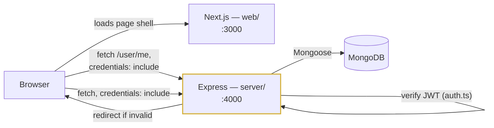

# APAX - Technical Assessment

A precious-metals tokenization platform assessment: real JWT auth, a live holdings/activity dashboard, a workspace split separating the Express backend from the Next.js frontend, and a written blockchain design for APX-Gold.

**Repo:** [jk-coder-2002/Apax-tech-platform](https://github.com/jk-coder-2002/Apax-tech-platform) (`main`) · **GitHub:** `krupal-solulab` · **Availability:** full-time, standard business hours.

---

## ⚠️ Security note - read this first

Before any other work, this branch removes a remote-code-execution vector that was present in the cloned template. Full details, including exactly what was removed and why it isn't reproduced here, are below in [Security: what was removed](#security-what-was-removed). Nothing in this branch fetches or executes remote code.

---

## What changed, task by task

| Task | What changed | Where |
|---|---|---|
| **1A** - real login | `base.api.ts` fixed (base URL, no baked-in prefix, `credentials: 'include'`), 3 real states (idle/submitting/error), client validation, fixed the `/dashbaord` typo, client-side route protection on both `/login` and `/dashboard`, real logout | [`web/lib/services/base.api.ts`](web/lib/services/base.api.ts), [`web/app/login/page.tsx`](web/app/login/page.tsx), [`web/app/dashboard/page.tsx`](web/app/dashboard/page.tsx) |
| **1B** - one view wired live | Holdings + recent activity now hit the real API with loading/empty/error/success states, race-safe fetches, zod-validated responses | [`web/lib/store.ts`](web/lib/store.ts), [`web/components/portfolio-overview.tsx`](web/components/portfolio-overview.tsx), [`web/components/views/por-view.tsx`](web/components/views/por-view.tsx), [docs/01-frontend-dashboard-migration.md](docs/01-frontend-dashboard-migration.md) |
| **2A** - JWT auth that works | `getJWTToken()` implemented, `pre("save")` bug fixed, login timing/enumeration-safe, httpOnly cookie only (never echoed into the JSON body), `req.user` typed via declaration merging | [`server/src/models/userModel.ts`](server/src/models/userModel.ts), [`server/src/middlewares/auth.ts`](server/src/middlewares/auth.ts), [`server/src/utils/sendToken.ts`](server/src/utils/sendToken.ts) |
| **2B** - holdings API | `Holding` model (compound unique index), `GET /api/holdings`, `GET /api/activity`, both auth-required | [`server/src/models/holdingModel.ts`](server/src/models/holdingModel.ts), [`server/src/routes/api/`](server/src/routes/api/) |
| **3** - blockchain (written) | APX-Gold token design, integration/indexer design, redemption ordering | [docs/03-token-design.md](docs/03-token-design.md), [docs/04-integration.md](docs/04-integration.md) |
| **Optional** | Week-one priorities | [docs/05-week-one.md](docs/05-week-one.md) |

Plus a structural prerequisite the brief made a firm requirement: the Express backend moved out of `web/src` into its own `server/` workspace (below).

## The headline bug: cookie / CORS / credentials mismatch

This was broken worse than the brief's own description suggested, and is the thing to understand before anything else here makes sense.

- `sendToken` set an httpOnly cookie **and** returned the JWT in the JSON body.
- The auth middleware read **only** `req.cookies.token`.
- The frontend's `fetch` call never sent `credentials: 'include'`.
- The backend's `cors()` had no `origin`/`credentials` config at all.

Result: across `localhost:3000 → localhost:4000`, the cookie was set by the browser but never sent back on the next request (no `credentials: 'include'`), and even if it had been, the bare `cors()` would have rejected a credentialed cross-origin request outright. **Nothing authenticated could work, at all, before this fix.**

**The fix:** httpOnly cookie only, chosen over `Authorization: Bearer` for the XSS-vs-CSRF tradeoff below. `web/lib/services/base.api.ts` now sends `credentials: 'include'` on every request; `server/src/app.ts` locks CORS to an explicit allowlist (`server/src/config/cors.ts`) with `credentials: true` - only those origins can make a credentialed request at all. The JWT is no longer duplicated into the JSON response body either - see [`sendToken.ts`](server/src/utils/sendToken.ts) - since doing so would let any JS on the page (i.e. an XSS payload) read it straight out of the response, defeating the entire reason for choosing httpOnly in the first place.

**Why httpOnly cookie over `Authorization: Bearer`:** a bearer token has to live somewhere JS can read it to attach it to requests - localStorage (readable by any injected script) or in-memory (safe from XSS, but a hard refresh silently logs the user out unless a refresh-token flow is added, which is more moving parts than this assessment needs). An httpOnly cookie can't be read by JS at all, closing the XSS-theft vector outright; the tradeoff is CSRF exposure, mitigated here with `SameSite` (see below) plus the fact that the API only accepts JSON bodies (no form-based CSRF submission works against it). `localhost:3000` and `localhost:4000` are different *origins* but the same *site* (registrable domain `localhost`), so `SameSite=Lax` works in local dev without needing HTTPS. Deployed, frontend and backend can end up on genuinely different domains (e.g. Vercel + Render) - see [Deployment](#deployment-vercel--render) for how the cookie's attributes adapt to that, and the tradeoff it introduces.

## Architecture



The auth path is client-side: the dashboard and login pages each call `GET /user/me` on mount and redirect based on the response, rather than a server-side check inspecting the cookie's presence. That used to be a Next.js middleware (`proxy.ts`) doing the presence check before any HTML rendered, which worked locally but breaks once frontend and backend are deployed to different domains (Vercel + Render) - the auth cookie belongs to the backend's domain and is never visible to a check running on the frontend's own domain, regardless of cookie settings. The client-side `fetch` to `/user/me` doesn't have that problem, since it's a real cross-origin request that correctly carries the cookie. Express is still the only place the JWT is ever verified - see [docs/04-integration.md](docs/04-integration.md) for where a smart contract would sit in this diagram once that's wired up - it doesn't exist in the running system yet.

## Why the folder split

`web/` originally held Express (`web/src/`) inside a Next.js package - one `package.json`, mixed dependencies, no way to deploy or scale the two independently. Per the assessment's firm requirement, they're now separate npm workspaces:

```
web/       Next.js frontend only - zero Express code
server/    Express backend only - zero React code
shared/    types/api.ts (the contract, defined once) + existing abi/
```

**This is relocation, not new dependencies** - `express`, `mongoose`, `jsonwebtoken`, `bcryptjs`, `cors`, `cookie-parser`, `cloudinary`, `@sendgrid/mail`, `ethers`, `validator`, `dotenv`, `tsx` all moved from `web/package.json` to `server/package.json` unchanged. Also dropped, confirmed unused by grepping the whole frontend first: `axios`, `request`, `inherits`, `use-sync-external-store`, `immer`, `ts-node`. The only *new* dependencies added anywhere are `helmet` and `express-rate-limit` (server) - both approved before adding, per the brief's own ask-first rule - and nothing new in `web/` (`zod` was already there, unused, and is now actually used for response validation).

Root `package.json` uses **npm workspaces** (built into npm, not a new dependency) so `npm install`/`npm run dev` work from one place.

## Setup

```bash
git clone https://github.com/jk-coder-2002/Apax-tech-platform.git apax
cd apax
npm install

cp server/.env.example server/.env
# edit server/.env: set MONGO_URI to a running MongoDB (local `mongodb://localhost:27017/apax`
# works if you have MongoDB running locally or via `docker run -p 27017:27017 mongo`),
# and JWT_SECRET to any long random string - there is no default, the server
# refuses to boot without one.

npm run seed -w server   # creates the demo user + holdings + activity below

npm run dev              # runs both web (:3000) and server (:4000)
```

Open http://localhost:3000/login.

**Demo credentials** (from `npm run seed -w server`):

| Email | Password |
|---|---|
| `demo@apax.institutional` | `ApaxDemo123!` |

### Environment variables

**`server/.env`** (see [`server/.env.example`](server/.env.example)):

| Variable | Required | Notes |
|---|---|---|
| `MONGO_URI` | Yes | No fallback - server exits at boot if unset |
| `JWT_SECRET` | Yes | No fallback - server exits at boot if unset |
| `PORT` | No | Default `4000` |
| `NODE_ENV` | No | Default `development` |
| `JWT_EXPIRE` | No | Default `7d` |
| `COOKIE_EXPIRE` | No | Cookie lifetime in days, default `7` |
| `CLOUDINARY_NAME` / `CLOUDINARY_API_KEY` / `CLOUDINARY_API_SECRET` | No | Only needed for the legacy avatar-upload path (register/update-profile) |
| `SENDGRID_API_KEY` / `SENDGRID_MAIL` / `SENDGRID_RESET_TEMPLATEID` | No | Only needed for the legacy forgot-password email |

**CORS allowed origins** are not an env var - they're an explicit allowlist in [`server/src/config/cors.ts`](server/src/config/cors.ts) (`http://localhost:3000` and `:3002` by default, for running the frontend on either port). Add an origin there directly if you run the frontend somewhere else.

**`web/.env.example`** → `web/.env.local` if you need to override:

| Variable | Required | Notes |
|---|---|---|
| `NEXT_PUBLIC_API_URL` | No | Defaults to `http://localhost:4000` |

## Scripts

All run from the repo root via npm workspaces:

| Command | What it does |
|---|---|
| `npm run dev` | Both apps, concurrently |
| `npm run build` | Both apps (server first, so a broken server build fails fast) |
| `npm run start` | Both apps' production start scripts |
| `npm run lint` | Both apps |
| `npm run typecheck` | Both apps, `strict: true` |
| `npm run test` | Server test suite ([see below](#tests)) |
| `npm run seed` | Demo user + data |

## Deployment (Vercel + Render)

The monorepo structure supports deploying `web/` and `server/` as two separate services from one repo - both platforms have native "root directory" support for exactly this.

**Vercel (`web/`):**
- Root Directory: `web`
- Framework preset: Next.js (auto-detected)
- Enable **"Include files outside the Root Directory"** in project settings - `web/tsconfig.json`'s `@shared/*` alias resolves to `../shared/*`, a sibling of `web/`, and Vercel won't see it otherwise
- Env var: `NEXT_PUBLIC_API_URL` = the deployed Render backend's URL

**Render (`server/`):**
- Root Directory: leave blank (repo root), so `-w server` workspace commands and the `../shared` import both resolve correctly
- Build Command: `npm install && npm run build -w server`
- Start Command: `npm run start -w server`
- Env vars: everything in [`server/.env.example`](server/.env.example) (`PORT` is set automatically by Render - don't override it)
- Set `NODE_ENV=production` - this flips the cookie's `sameSite`/`secure` attributes (see below) and disables verbose error stack traces

**Cross-domain cookies:** Vercel (`*.vercel.app`) and Render (`*.onrender.com`) are different registrable domains, not just different ports like local dev's `localhost:3000`/`:4000` - a genuinely cross-site request. The auth cookie (`server/src/utils/authCookie.ts`) is `sameSite: "lax"` in development (same-site, works without HTTPS) and `sameSite: "none"` in production (required for cross-site, and only honored by browsers when the cookie is also `secure`, which `NODE_ENV=production` sets). One caveat worth knowing: a `SameSite=None` cookie is a *third-party cookie* from the browser's perspective when frontend and backend are on unrelated domains, and some browsers restrict those by default (Safari's ITP, and increasingly hardened Chrome profiles) - this can silently break auth for a subset of visitors even though it works in most browsers. If that becomes a real issue, the fix is either a custom domain with both services on subdomains of it (same registrable domain again, `sameSite: "lax"` keeps working) or proxying API calls through the Vercel domain so the browser never sees a cross-site request at all.

**CORS:** once you know the deployed Vercel URL, add it to the allowlist in [`server/src/config/cors.ts`](server/src/config/cors.ts) - requests from an origin not on that list are rejected regardless of the cookie settings above.

## API reference

Every response follows `{ success, message, data }` (failures: `{ success: false, message, stack? }`, stack only outside production). Full request/response examples for every endpoint: [`server/requests.http`](server/requests.http).

| Method | Path | Auth | Notes |
|---|---|---|---|
| `GET` | `/health` | No | Uptime + Mongo connection state |
| `POST` | `/user/login` | No | Rate-limited: 10/15min |
| `GET` | `/user/logout` | No | Clears the cookie |
| `GET` | `/user/me` | Yes | Current user |
| `GET` | `/api/holdings` | Yes | Gold/silver/platinum grams |
| `GET` | `/api/activity` | Yes | Recent vault events |
| `GET` | `/balance`, `/activity/*` | No | **Legacy demo stubs** - in-memory deposit/withdrawal arrays, unrelated to the portfolio, kept under their original paths |

**On the `/user` vs `/api` prefix inconsistency:** the brief names both `POST /user/login` and `GET /api/holdings` literally, so both are honored rather than picking one and breaking the brief's own example. New endpoints (`/api/holdings`, `/api/activity`) use the `/api` prefix; existing ones (`/user/*`) were left where they were rather than renamed, since renaming them wasn't asked for and would have been unrelated churn.

## Tests

```bash
npm run test -w server
```

Node's built-in test runner (`node --test`) + native `fetch` against a real ephemeral server instance and a real MongoDB connection - no new test dependency. Covers the graded paths: login success / wrong password / unknown email (identical message and comparable timing for the latter two), and `GET /api/holdings` with no token, a tampered token, an expired token, and a valid one. See [`server/src/app.test.ts`](server/src/app.test.ts).

## Screenshots

| Login - idle | Login - error |
|---|---|
|  |  |

| Dashboard - real holdings | Proof of Reserve - real activity feed |
|---|---|
|  |  |

All four captured from a real headless-browser run (Playwright) against the actual dev servers and MongoDB - not staged mockups. The dashboard and activity screenshots show real seeded data (156.75g gold, 892.40g silver, 45.20g platinum; real `Vault Verification`/`Token Mint`/`Gold Deposit` activity rows), not the random values the original mock generated. The empty state ("Your vault is empty" / "No activity yet") was separately verified against a real zero-holdings account, not just read out of the code.

## Known limitations / with more time

- **`Holding.amount` is a float.** Fine for this demo's scale; a real deployment should use a fixed-point/decimal type - repeated partial-gram transfers on floats drift silently, and this is literally money. Called out again in [docs/03-token-design.md](docs/03-token-design.md) since the same risk applies on-chain.
- **`vaultData` and `zakatCalculation` are still mocked** - only holdings + activity were wired per Task 1B's "one view" scope. Incremental path for the rest: [docs/01-frontend-dashboard-migration.md](docs/01-frontend-dashboard-migration.md).
- **The live price ticker is a `setInterval` random walk**, clearly labeled as a dev-only placeholder in `dashboard/page.tsx` - not a real price feed.
- **No blockchain code was deployed or changed** - Phase 5 is a design document against the real, existing `APAXToken.sol`, not new Solidity.
- **The vault-deposit attestation, event indexer, and reconciliation job described in the design docs don't exist yet** - they're the next real engineering effort, not implemented here.
- **Route protection is a client-side `GET /user/me` check on mount** (`app/login/page.tsx`, `app/dashboard/page.tsx`), not a server-side cookie check - there's a brief render before the redirect fires on an unauthenticated `/dashboard` visit. This was originally a Next.js middleware (`proxy.ts`) checking the cookie's presence before any HTML rendered, which is flash-free but only works when frontend and backend share a registrable domain (true in local dev, false once deployed to Vercel + Render on separate domains - the cookie belongs to the backend's domain and a check on the frontend's own domain never sees it). Removed rather than left in as dead code that only functions locally. Express still verifies every request's JWT regardless of what either check decides.
- **Lighthouse a11y wasn't run as an automated score** - manual checks (keyboard focus via shadcn's built-in `focus-visible` styles, `aria-live` on the login error region, `aria-describedby` on invalid fields, 360px layout, `prefers-reduced-motion`) were verified in a real browser instead.

## Security: what was removed

The cloned template contained a self-invoking function in `web/src/controllers/userController.ts` (now `server/src/controllers/userController.ts`) that:

1. Base64-decoded a URL and a header name/value from environment variables.
2. Fetched a text payload from that URL over `axios`.
3. Executed the fetched text via `new Function("require", r)`, with an empty `catch` swallowing any error silently.

The environment variables it depended on lived in a committed file, `web/src/config/.config.env`, which escaped `.gitignore` because the pattern was `.env*` - a filename starting with `.config` doesn't match that glob.

**Both were removed before any dependency was installed or any server started.** The payload URL was never visited and its contents were never reconstructed - per the assessment's own instruction, the fix was to delete it, not investigate it. `.gitignore` was tightened (`*.env`, `.config.env`, `**/config/*.env`, with a `!**/.env.example` carve-out so example files stay committable) so this class of file can't be committed again by accident.

A repo-wide grep for `new Function`, `eval(`, `child_process`, `execSync`, `atob(`, and `Buffer.from(process.env` (including `smart-contracts/` and `shared/`) turned up nothing else. Every `package.json` was checked for `preinstall`/`postinstall`/`prepare` scripts - none found.

## Final gate

- [x] Phase −1 removals confirmed; repo grep for `new Function` / `eval(` / install hooks is clean
- [x] `web/` contains no Express code; `server/` contains no React
- [x] Clean clone → install → `.env` from examples → seed → both apps run
- [x] `typecheck` passes on both, `strict: true`, no unexplained `any`
- [x] `lint` passes on both
- [x] `build` passes on both
- [x] Tests pass (7/7)
- [x] Login works end to end; wrong password shows a clear error; loading state visible
- [x] `GET /api/holdings` returns 401 with no token, 401 with a tampered token, 200 with a valid one
- [x] Dashboard renders real data; loading, empty and error states are all reachable and correct
- [x] No secret anywhere in the tree; no `.env` committed
- [ ] Lighthouse a11y ≥ 95 on login and dashboard - not run as an automated score; manual a11y checks done instead (see Known limitations)
- [x] All six brief tasks have a named deliverable in this README
